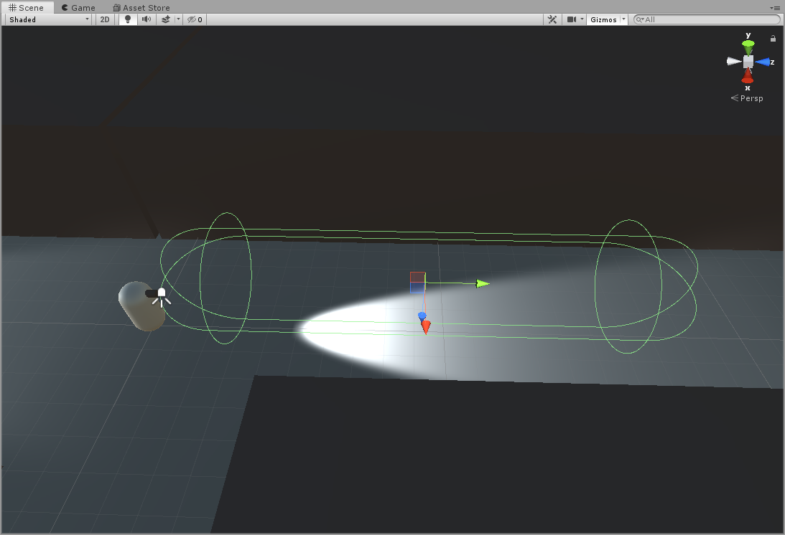
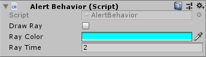

This document talks about the ways to implement detection using the package.

## BasicDetection

The `BasicDetection` uses a combination of triggers and a raycast to detect
`SuspiciousObjects`.

For this to work the trigger object should be a child of your script that implements
the `Guard` class. It is recommended to add the `Ignore Raycast` layer to the trigger object.

The following image is an example of the detection cone used in the test project.

Whenever a `SuspiciousObject` enters the trigger, there will be a raycast shot
from the found object to the `Guard`. If this raycast hits the `Guard` first,
the `ChangeState()` method is triggered on the `Guard`. If not, execution
continues as normal.

Debugging options are available to visalize the raycast and log the name of the
object that was hit.

