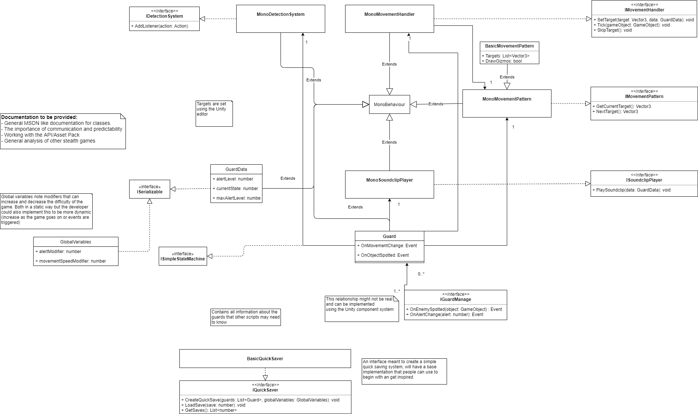
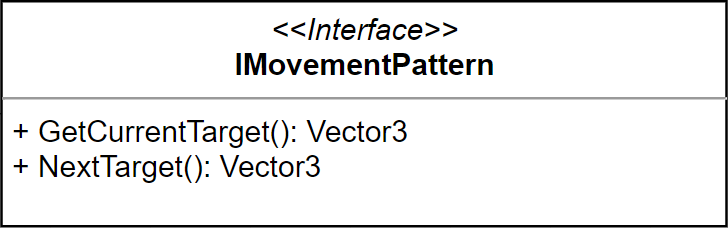
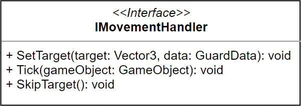

Movement can be implemented in many different ways within games.
The idea of this pack was to keep this implementation as close as possible to the
developer. Offering a few basic options but nothing complex.
There are simple interfaces and classes available for the developer to work off
and make into their own scripts to handle movement.

## Overview

The pack mostly contains out of 3 layers:

- Interface
- MonoExtension
- Implementation

These layers can be seen in the following UML diagram and will be explained further.

### Interface layer

The interface layer is designed for games that might move away from the `MonoBehaviour`
class into normal C# classes or something like ECS. These interfaces define the methods
that will be implemented all the way down and document the intend of these methods.

The movement scripts contain two interfaces

#### IMovementPattern

This interface defines the methods that belong to getting nodes from a set pattern.
The idea is that a designer can set a certain amount of nodes that a guard can move to.
The script that handles movement can call the `GetNextTarget()`, this script
gives the next target in the array.

### IMovementHandler

