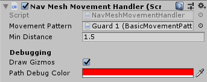

Movement can be implemented in many different ways within games.
The idea of this pack was to keep this implementation as close as possible to the
developer. Offering a few basic options but nothing complex.
There are simple interfaces and classes available for the developer to work off
and make into their own scripts to handle movement.

## Overview

The pack mostly contains out of 3 layers:

- Interfaces
- MonoExtensions
- Implementations

These layers can be seen in the following UML diagram and will be explained further.

## Interfaces

The interface layer is designed for games that might move away from the `MonoBehaviour`
class into normal C# classes or something like ECS. These interfaces define the methods
that will be implemented all the way down and document the intend of these methods.

The movement scripts contain two interfaces

### IMovementPattern

This interface defines the methods that belong to getting nodes from a set pattern.
The idea is that a designer can set a certain amount of nodes that a guard can move to.
The script that handles movement can call the `GetNextTarget()`, this script
gives the next target in the array.

### IMovementHandler

The `IMovementHandler` interface is meant for doing the movement of your
guards. These methods will be called from an external script and provide a direction
for your guard to move in. This may be used in conjunction with `IMovementPattern`
to create a predictable pattern.

## MonoExtensions

The `MonoExtensions` are simple classes that implement their interface counterparts
and Unity's MonoBehaviour. These scripts are for easier use in the Unity Editor.

### MonoMovementPattern

This abstract class implements the `IMovementPattern` interface and `MonoBehaviour`.

### MonoMovementHandler

This abstract class implements the `IMovementHandler` interface and `MonoBehaviour`.
This class also adds a relationship to MonoMovementPattern.
The field could be ignored or a more basic version could be made by simply
just implementing the interface.

## Implementations

These are out of the box solutions that can work in basic games.
It would not be recommended to use these in more complex systems as more fine control
could be needed.

> Please feel free to submit any other basic implementation to the
> [GitHub](https://github.com/bartdebever/StealthPack).

### BasicMovementPattern

The `BasicMovementPattern` is made to supply points as a very simple `Vector3` array.
This array can be set in the editor and possibly be overwritten when needed.

A counter will count up every time a rotation is done. When the configured amount
of rotations is done, the pattern will reset to the first configured pattern.
There also exists an option to skip the current target.

### NavMeshMovementHandler

The `NavMeshMovementHandler` is made to use Unity's `NavMesh`.
This script uses an instance of the `MonoMovementPattern` to gain destinations
and walk towards the point.

The script provides Gizmos for debugging, a WireSphere will be drawn at the location
that the Guard has as it's target and a line (with the configured color) will
be drawn that represents the path that will be taken towards that point.

The gif below shows both the `BasicMovementPattern` and `NavMeshMovementHandler`
working together.
Note that all debug options are enabled here.

