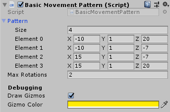

Within this document the essentials of the pack from the guard side of things are stated.
This document goes over the most basic of interaction between the different scripts
and how the scripts were intended to be used.

## The scripts

This is a basic overview of some of the essential scripts within the package.
These scripts will be explained in a little more detail within the rest of this
document. For full detailed explanations of these scripts, there is a "More info"
link at the bottom of the basic explanation.

| Script | Use case |
|---------|-----------------|
| Guard | Base scripts that connects together other scripts and inherits from the BasicStateMachine. |
| MonoMovementPattern | Defines a set number of `Vector3`s that the guard will go to. |
| MonoMovementHandler | Inheritable script that is for moving the guard to places. |
| BasicStateMachine | Allows for an easy implementation of an alert system with different levels |
| GuardData | Statistics that are unique to that guard. Can be used to alter speed or vision distance.|
| SuspiciousObject| Defines an object or component as suspicious and can be seen by a guard.|
| ISaveableScript | Allows for a script to be quick loaded and saved if set up correctly. |

Furthermore, please note that all scripts are made to be expandable.
Most if not all scripts feature their methods as `abstract` or `virtual` and their
internal parameters as `protected`.

> If you do encounter a class which is not build this way, please feel free to submit an issue.

## Guard

This is the base script that puts everything together. This script is used to
take the in the other scripts and tie them all together.

This is a perfect place for custom code and allows for calls to nearly all components
within the system.

By default, the Guard script features a `FixedUpdate()`. This will simply check if
there is a `MonoMovementHandler` and if so, call the `Tick()` method on it.

## MonoMovementPattern

Within this script the developer can define how a pattern is generated for the guard
to walk around. This could be a static path or a dynamic path. The choice on how
to implement this is yours.

The pattern is meant to consist out of nodes. With each note indicating a spot to
inspect for the guard. This can be disregarded if the implementation of the
`MonoMovementHandler` allows for it.

### BasicMovementPattern

The `BasicMovementHandler` is an implementation of `MonoMovementPattern` that
allows for the developer/designer to set the nodes in the editor on a `Vector3` basis.
With the `DrawGizmos` variable, you can also allow for all of the nodes in the pattern
to be visualized.

> Note that this is a screenshot of the still in development version and may not
> reflect the final product.

## MonoMovementHandler

This script is intended to move the guard from node to node or however you wish
to implement movement. By default this script has a dependency on the `MonoMovementPattern`
yet this is not enforced, not adding this script will not cause any errors.

This script contains then `Tick` method this method is meant to move the guard
further towards its destination.

More documentation of what the methods are supposed to do is found on the interface,
for `MonoMovementHandler` that is `IMovementHandler`.

### NavMeshMovementHandler

For NavMesh based movement there exists a basic handler. This handler gets the
a point from the `MonoMovementPattern` and moves towards it. When it is close enough,
it will pick a next target and move towards that.

The script also features a `DrawGizmos` option where the current destination and
the path towards it are drawn.

Using this in combination with the `BasicMovementPattern` can have the following result.

## BasicStateMachine

## GuardData

## SuspiciousObject

## ISaveableScript
